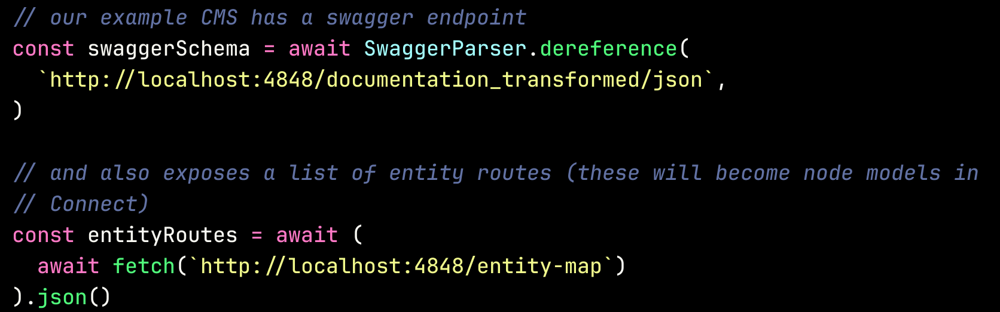
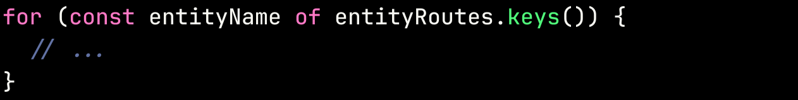
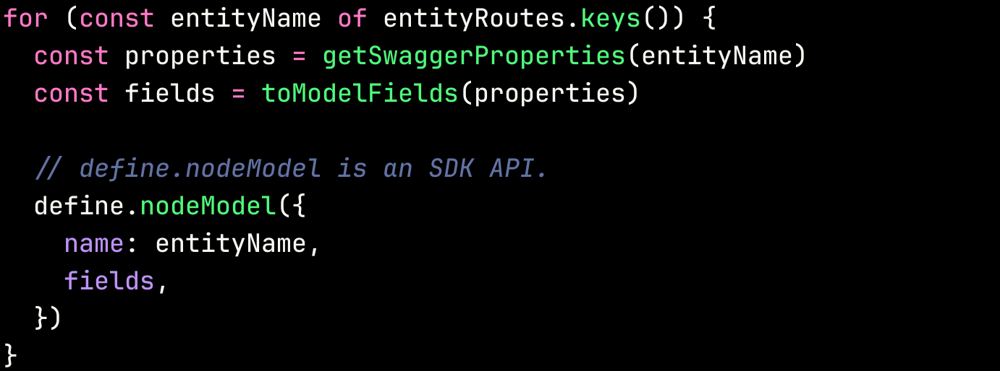
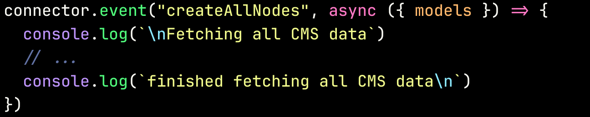
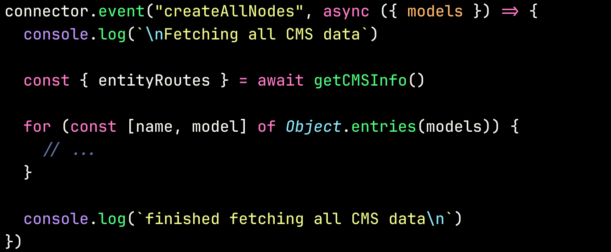
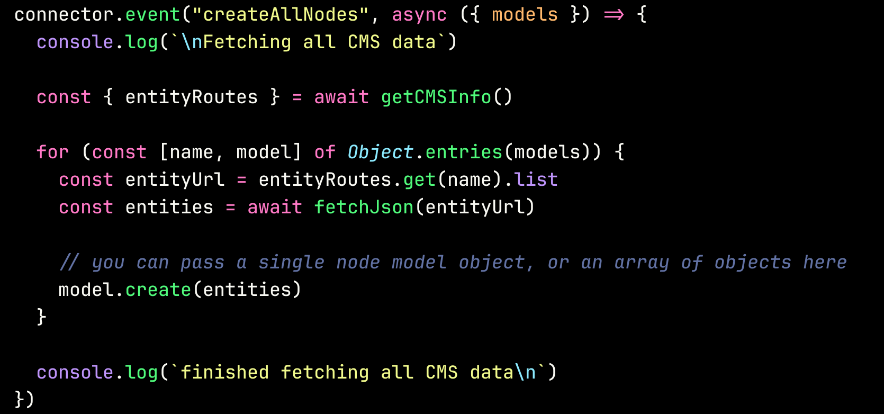
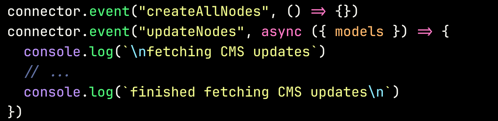
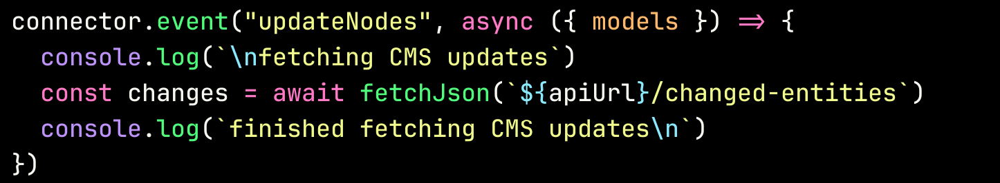
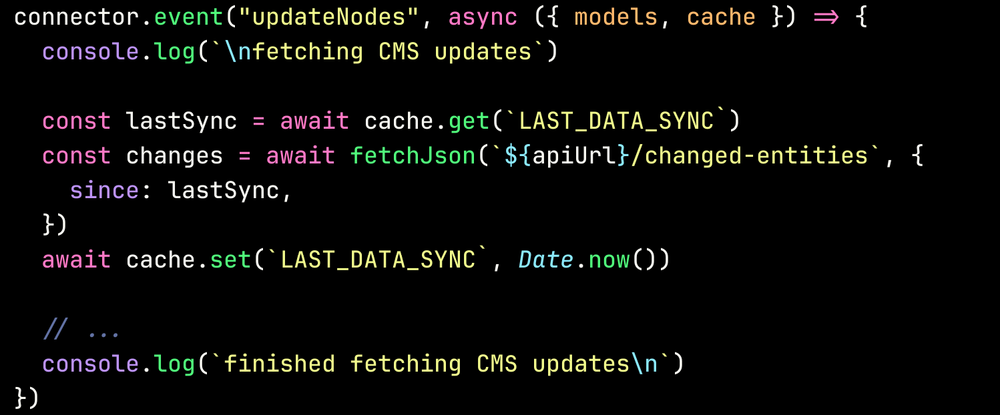
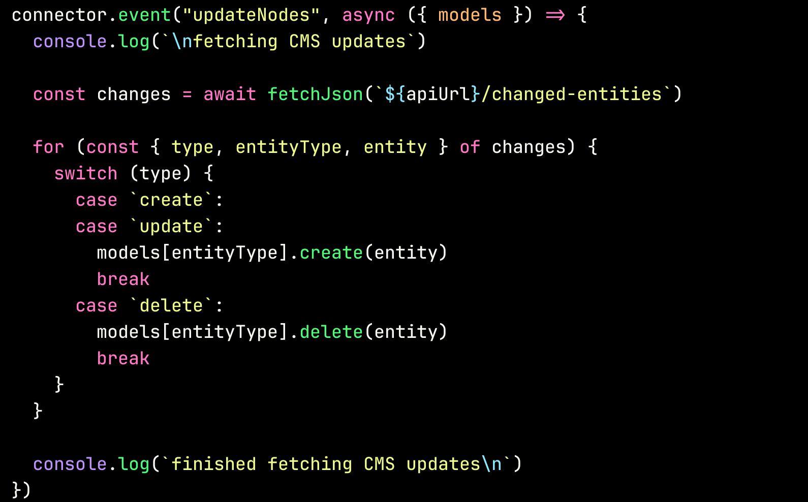

---
theme:
name: dark
override:
code:
  alignment: center
  minimum_size: 50
  minimum_margin:
    percent: 8
  theme_name: base16-eighties.dark
  colors:
    background: "000000"
  padding:
    horizontal: 0
    vertical: 1
inline_code:
  colors:
    background: "000000"

title: Custom CMS Connectors
sub_title: with the Netlify SDK
---

## Overview

This part of the workshop shows how to take a dynamic data source like a CMS and
integrate it into Netlify Connect as a developer.

<!-- pause -->

### Who is this for?

<!-- pause -->

- Enterprise developers who build and maintain disparate data sources and API's
<!-- pause -->
- Developers who want to add Netlify Connect support to their favourite CMS
<!-- pause -->

- Anyone who's interested in Netlify Connect and the Netlify SDK!

<!-- pause -->

&nbsp;

<!-- pause -->

## What we'll cover

<!-- pause -->

- A demo of a custom CMS Connector
<!-- pause -->

- Dynamically building Connect models
<!-- pause -->
- Fetching all data from a CMS into Connect
<!-- pause -->
- Updating data in response to changes in the CMS

<!-- pause -->

<!-- end_slide -->

## Demo time

🚀🚀🚀

1. A mock CMS with Swagger API (http://localhost:4848/documentation/static/index.html)
2. A Custom Connector (http://localhost:8000/\_\_graphql)

<!-- end_slide -->

## 1. Defining dynamic node models

### Understanding models

<!-- pause -->

- Open the `dev-model.gql` GraphQL SDL file that's generated into your project
directory
<!-- pause -->
- Compare it with the Swagger UI schema http://localhost:4848/documentation/static/index.html

<!-- end_slide -->

## 1. Defining dynamic node models

### Generating models

<!-- pause -->

Fetch the remote schema data

<!-- end_slide -->

## 1. Defining dynamic node models

### Generating models

Iterate on the returned data

<!-- end_slide -->

## 1. Defining dynamic node models

### Generating models

Translate the remote schema into node model/object/union definitions

<!-- end_slide -->

## 2. Fetching all data from a CMS into Connect

<!-- pause -->

There are 2 main data fetching scenarios:

- Full data fetch
- Changed data fetch
<!-- end_slide -->

## 2. Fetching all data from a CMS into Connect

### Initial full data fetch

<!-- pause -->

Use the `createAllNodes` SDK API

<!-- end_slide -->

## 2. Fetching all data from a CMS into Connect

### Initial full data fetch

Using some data from your CMS, determine which routes to fetch for each model that
was defined in previous steps.

<!-- pause -->

<!-- end_slide -->

## 2. Fetching all data from a CMS into Connect

### Initial full data fetch

Fetch data from your data source and insert it into the Connect DB using
`models.ModelName.create()`

<!-- pause -->

<!-- end_slide -->

## 2. Subsequent changed data updates

<!-- pause -->

Whenever data is updated in your data source, your Connector can react to it and
update the Connect DB accordingly

<!-- end_slide -->

## 2. Subsequent changed data updates

Implement the `updateNodes` SDK API:

<!-- end_slide -->

## 2. Subsequent changed data updates

Fetch a list of recent changes from your data source

<!-- end_slide -->

## 2. Subsequent changed data updates

You can use `cache.get()` and `cache.set()` to store a sync token or timestamp since your last sync.

<!-- pause -->

<!-- end_slide -->

## 2. Subsequent changed data updates

Iterate on the received data and create/update/delete nodes in the Connect DB

<!-- end_slide -->

### Conclusion

<!-- pause -->

- Syncing remote schemas and datasets into a single API is difficult
without Netlify Connect
<!-- pause -->
- You can build a Connector for your dynamic data source today, **without breaking a
  sweat**

<!-- end_slide -->
